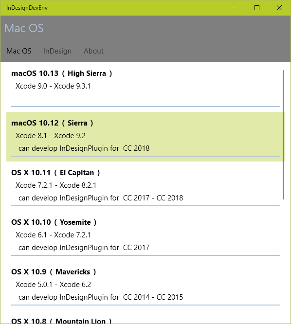

* ## InDesignDevEnv
InDesign Plug-ins Dev note.

- [日本語](#アプリ)
- [English](#App)

# PrivacyPolicy (プライバシーポリシー)

- [PrivacyPolicy Page](./privacypolicy.md)

# for Windows  (Microsoft store)

- [Microsoft Store](https://www.microsoft.com/ja-jp/p/indesigndevenv/9n30mhl1htf9)

# for Android (google play)

- [google play](https://play.google.com/store/apps/details?id=io.github.mimemo.InDesignDevEnv)

# for macOS (beta version)

- [macOS Version](./mac/readme.md)

- ベータ版です。UIが適切に表示されません
- Beta version. UI does not display properly.

# アプリ

このアプリはリファレンス情報のみ表示します。

機能：Adobe InDesignプラグインの開発環境一覧を表示.

InDesignプラグイン／Xcode／MacOS, VisualStudio／Windows の組み合わせを表示。

リスト：  

InDesignのバージョンとプラグイン開発に必要なXcodeバージョン：  

MacOSとOSでサポートされるXcodeバージョン  

# 履歴

## v1.7,  (2020/09/10) for Android only.
- タブが見えにくかったのを修正

## v1.6,  (2020/09/08)
- 一部古い情報を更新

## v1.5,  (2020/02/03)
- 一部古い情報を更新

## v1.4,  (2019/11/27)
- CC2020情報を追加

## v1.3,  (2019/07/24)
- 一部古い情報を更新

## v1.2,  (2018/10/16)
- CC2019情報を追加

## v1.1,  (2018/06/21)
- WindowsとVisualStudioの組み合わせを追加.

## v1.0 (2018/06/04)
- 初期版

# App

This app only displays some information. (It is not a development environment)

- App can view Info on adobe indesign-plugin development enviroments.
- With this application, reference information can only be viewed.
- This application is not a development environment.

## background:
- In the InDesign-Plugin development environment, the specified version of xcode is required.
- Also, Xcode has a limited MacOS version that can be installed.
- That's why I thought it would be convenient if I could check the combination of InDesignPlugin version, Xcode version that can develop it, and OS version that works.

List：  
 

InDesign version and Xcode version required for plug-in development：  

macOS version, and Xcode version supported by macOS  

# history

## v1.7,  (2020/09/10) for Android only.
- Fixed the tabs that were hard to see.

## v1.6,  (2020/09/08)
- Update some information.
- 
## v1.5,  (2020/02/03)
- Update some information.

## v1.4,  (2019/11/27)
- Added cc2020 info.

## v1.3,  (2019/07/24)
- Update some information.

## v1.2,  (2018/10/16)
- Added cc2019 info.

## v1.1,  (2018/06/21)
- A combination of WindowsOS and VisualStudio has been added.

## v1.0,  (2018/06/04)
- Initial version.